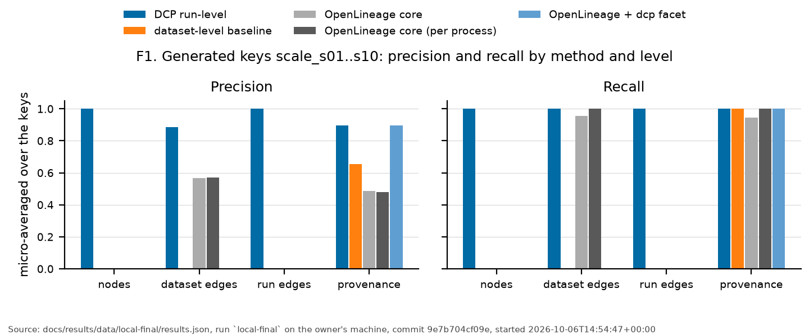

# DCP — Data Connectivity Protocol

**Transport-layer data lineage.** Capture lineage where data physically moves — the wire —
not from what applications report they did.

> One-liner: *"OpenTelemetry for data lineage."*

---

## What this repo is

DCP is a **measurement instrument**. Its purpose is to answer one question with numbers:

> How much real data movement do application-layer lineage systems (OpenLineage, DataHub,
> Atlas) structurally fail to see?

Everything in this repo exists to produce that measurement credibly. The SDK, the backend,
and the OpenLineage bridge are apparatus; `/benchmarks` is the product.

## The claim v1 makes

*"Here is a data movement that OpenLineage provably misses, DCP catches it, and the
overhead is under 1 ms p99."*

If the benchmarks show that, the thesis holds. If DCP merely re-derives edges OpenLineage
already had, it is a demo, not a finding. That distinction is enforced in
`benchmarks/README.md`.

## Status

**v0.1.0; v1 is closed.** The final report, with the definition of done item by item, is
[`docs/results/V1.md`](docs/results/V1.md). Every known limitation and its product
follow-up: [`docs/LIMITATIONS.md`](docs/LIMITATIONS.md). How every owner-machine number
was produced: [`docs/RUNBOOK.md`](docs/RUNBOOK.md), and each run's protocol status:
[`docs/results/local-runs.md`](docs/results/local-runs.md).

## Results (v1)

v1 is closed: [`docs/results/V1.md`](docs/results/V1.md) is the final report, with the
definition of done item by item. Headline rows, copied from the paper evidence pack
[`docs/paper/evidence.md`](docs/paper/evidence.md) by `benchmarks/evidence.py` (never
retyped; taken from the owner's machine's records where they exist):

<!-- evidence:summary:start -->

Copied from [`docs/paper/evidence.md`](docs/paper/evidence.md) by `python benchmarks/evidence.py`; do not edit by hand.

| Claim | What | Result | Record |
|---|---|---|---|
| [C1](docs/paper/evidence.md#c1-coverage) | Coverage, live | case 1 (Ad-hoc script): demonstrated live; case 2 (Notebook): demonstrated live; case 3 (Shared topic, run-level precision): demonstrated live. OpenLineage events from the same programs without DCP: 0 | [`P5-local-final.md`](docs/results/P5-local-final.md), owner |
| [C3](docs/paper/evidence.md#c3-accuracy-at-scale) | Accuracy at scale, provenance | DCP run-level: precision 891/995 = 0.895, recall 891/891 = 1.000; OpenLineage core (per process): precision 891/1855 = 0.480, recall 891/891 = 1.000 | [`P5-local-final.md`](docs/results/P5-local-final.md), owner |
| [C4](docs/paper/evidence.md#c4-failure-modes) | Failure modes (stress set), provenance | DCP run-level: precision 402/452 = 0.889, recall 402/457 = 0.880; dataset-level baseline: precision 457/640 = 0.714, recall 457/457 = 1.000 | [`P5-local-final.md`](docs/results/P5-local-final.md), owner |
| [C6](docs/paper/evidence.md#c6-overhead) | < 1 ms p99 added, `file` sink | T1 met, T2 met, T3 met, T4 met, T5 met, L1 met, L3 met, L5 met | [`P5-local-final.md`](docs/results/P5-local-final.md), owner |
| [C8](docs/paper/evidence.md#c8-throughput-model) | Throughput, as a fixed cost per call (`file` sink) | T1 point read: +72.2 [+69.1, +75.3] µs per call, under 2% for queries slower than 3536.1 µs; L5 analytical, literal (added in P5.1): +177.1 [+132.9, +213.4] µs per call, under 2% for queries slower than 8678.2 µs | [`P5-local-final-fixed-cost.md`](docs/results/P5-local-final-fixed-cost.md), owner |

<!-- evidence:summary:end -->



*F1: precision and recall on the ten generated 30-job keys, by method and level
([`benchmarks/figures.py`](benchmarks/figures.py), from the raw results JSON named in its
footer). F2, the same on the stress set, and F3-F5, overhead, are in
[`docs/paper/figures/`](docs/paper/figures/).*

- **Where DCP fails, measured:** the stress set exercises DCP's two known failure modes
  (multi-record consumers, store-mediated reads); every miss is counted by cause.
  Every known limitation and its product follow-up: [`docs/LIMITATIONS.md`](docs/LIMITATIONS.md).
- **The owner's procedure** (the full-mode runs, the demo timing, the release):
  [`docs/RUNBOOK.md`](docs/RUNBOOK.md); the runs themselves:
  [`docs/results/local-runs.md`](docs/results/local-runs.md).
- Phase by phase: [`CHANGELOG.md`](CHANGELOG.md).

## How it works

1. **Intercept** at the session boundary — `dcp.patch_psycopg()` wraps the Postgres DBAPI;
   a Kafka interceptor wraps produce/consume.
2. **Propagate** a provenance context across hops using metadata channels the protocols
   already have — a SQL comment for Postgres, a record header for Kafka.
3. **Emit** standard OpenLineage so the graph lands in tooling people already run (Marquez,
   DataHub), rather than asking anyone to adopt a new catalog.

## v1 scope

| | IN | OUT (later) |
|---|---|---|
| Protocols | Postgres (Python DBAPI), Kafka | JDBC, gRPC, HTTP, S3, MySQL |
| Granularity | Table/dataset-level (attested); the envelope's optional `columns` field is defined but not filled by v1's interceptors | Column names; column-to-column mapping |
| Language | Python | Java, Go, Node |
| Deployment | In-process library | Sidecar, eBPF |
| Mode | Monitor-only | Inline enforcement / blocking |
| Storage | networkx in-memory + SQLite event log | Graph DB, temporal versioning |

Why Python first: the dark zones application-layer tools miss — ad-hoc scripts, notebooks,
glue jobs — are overwhelmingly Python. That is precisely the gap being measured.

## Quickstart

No code changes: run the script under `dcp-instrument`. On Linux or macOS (bash):

```bash
pip install -e "./sdk-python[postgres,kafka]"
DCP_EMIT=file://dcp_events.jsonl dcp-instrument python my_script.py
```

On Windows PowerShell: `$env:DCP_EMIT = "file://dcp_events.jsonl"; dcp-instrument python my_script.py`.

| Variable | Meaning | Default |
|---|---|---|
| `DCP_EMIT` | Sink: `console`, `file://path` (written before each call returns; `file://path?sync=0` writes from a background thread), `http://host:port` (the DCP backend), or `null://` (a diagnostic: builds every event, records none) | `console` |
| `DCP_JOB_NAME` | Job name | The script's basename |
| `DCP_PROPAGATE_SQL` | `1` appends the trace comment to outbound SQL (spec §3) | Off |
| `DCP_CAPTURE` | `off` is the kill switch: the patches stay installed but capture nothing | On |

`dcp-instrument` runs the command as a subprocess with DCP's `sitecustomize` first on
`PYTHONPATH`. DCP initialises at start-up and hooks psycopg, confluent-kafka and
`ThreadPoolExecutor`: each is patched right after the script imports it, before
the import returns, so `from confluent_kafka import Producer` binds the patched
class and a script that never imports a library never loads it. Any existing
`sitecustomize` still runs. If DCP cannot start, the script runs uninstrumented.

The explicit form still works, for code that prefers it:

```python
import dcp
dcp.init(emit="console")
dcp.patch_psycopg()
dcp.patch_kafka()        # before `from confluent_kafka import Producer`
dcp.patch_threadpool()   # optional: keep the trace inside ThreadPoolExecutor workers
```


## Layout

| Path | What | Phase |
|---|---|---|
| `spec/` | Provenance envelope, dataset identity, propagation rules | P0 |
| `sdk-python/` | Interceptors, context propagation, emitters | P1–P2 |
| `backend/` | Ingest, identity resolution, graph, query API | P3 |
| `bridges/openlineage/` | DCP events → OpenLineage RunEvents | P4 |
| `examples/dark-zone/` | docker-compose demo of the gap scenario | P5 |
| `benchmarks/` | Ground truth, adversarial suite, overhead protocol | P0 + P5 |

## Non-goals (v1)

- No column-to-column mapping — requires payload/transformation parsing.
- No enforcement or blocking — monitor-only; inline blocking is a new availability risk.
- No sampling — a dropped edge disconnects the graph, which is not true of tracing.
- Unenlightened hops break the chain; the graph degrades to disconnected-but-attested edges.

## How to cite

Cite the software with the metadata in [`CITATION.cff`](CITATION.cff) (GitHub's *Cite this
repository* button reads it).

## Development methodology

DCP was conceived, designed and evaluated by Dev Desai, who set the research direction, made scope and design decisions. AI assistants supported the implementation. Each phase was built from a written task specification, retained in [`docs/tasks/`](docs/tasks/) as a record of the decisions and pre-registered expectations that preceded the results.

## License

Apache 2.0 ([`LICENSE`](LICENSE)).
